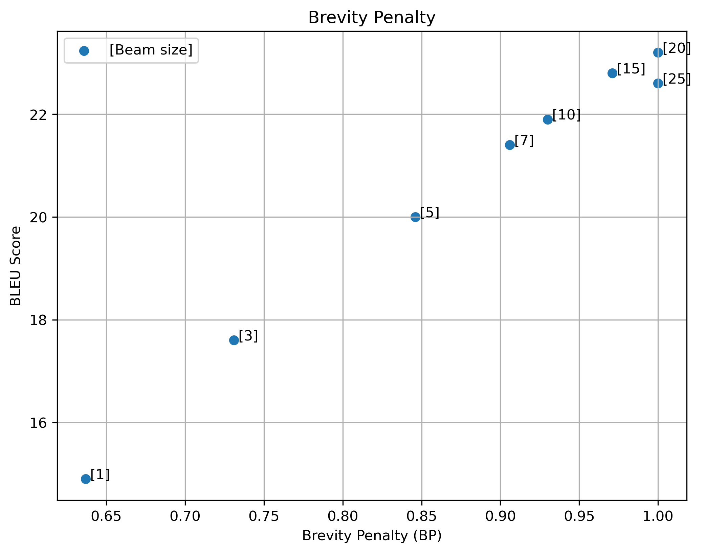

# Assignment 5: improve decoding in NMT

## 1. Experiment with Beam Search

The same data as in assignment 3 is used, including the baseline model: `assignments/03/baseline/checkpoints/checkpoint_best.pt`.

The following python script does translation using beam search for beam sizes $[1, 3, 5, 7, 10, 15, 20, 25]$ and generates three plots. In this script the hyperparameter $\alpha = 0.6$ is chosen for length normalization.

```
python assignments/05/beam_size_experiment.py
```




